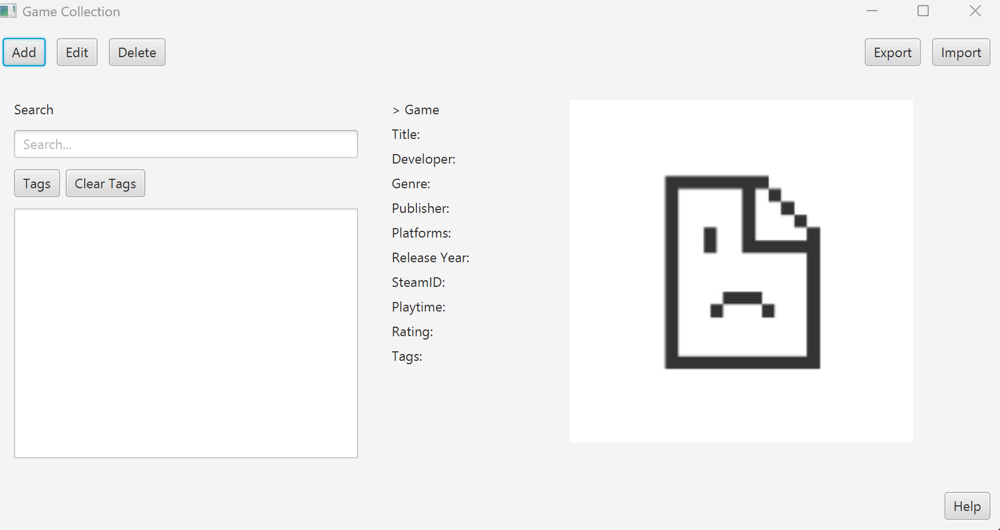
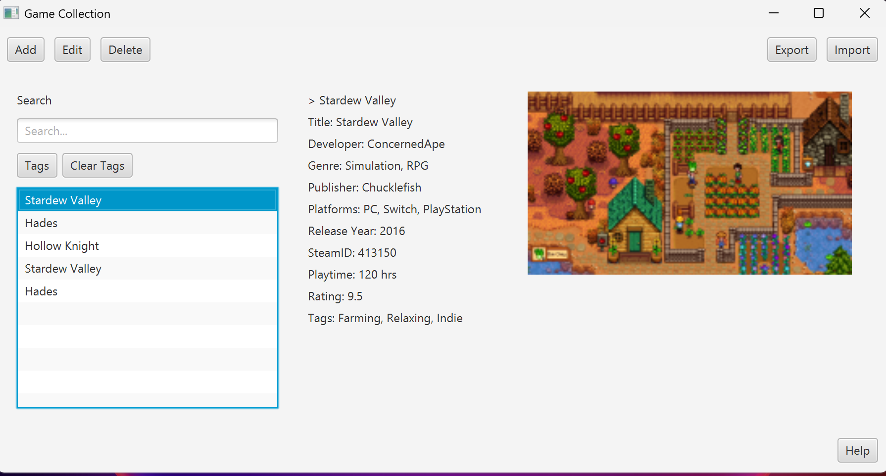
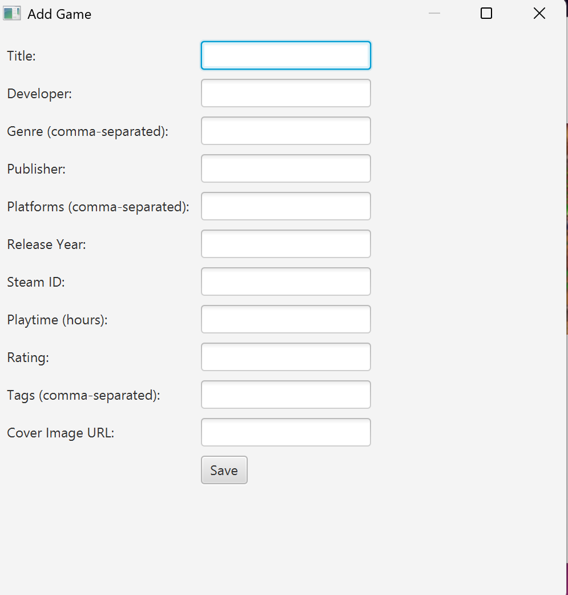

# Game Catalog 216

This project is a **video game catalog management application** developed for the **CE216 course (Spring 2024–2025)**.

The goal of the project is to create a software system that allows users to organize and manage their personal video game collections. The application enables users to store detailed information about games, search through the catalog, and filter games using different properties.

Each video game entry includes information such as title, developer, release year, platforms, playtime, genres, and other metadata.

The project also supports **reading and writing JSON files**, allowing the catalog to be easily imported and exported.

---

# Features

- Add new video games to the catalog
- Edit existing game information
- Delete games from the catalog
- Search games using different properties
- Filter games by tags
- Import game data from JSON files
- Export selected games to JSON files
- Display and manage cover images
- User manual accessible through the Help menu

---

# Game Information Fields

Each game entry can contain the following attributes:

- Title
- Genre
- Developer
- Publisher
- Platforms
- Translators
- Steam App ID
- Release Year
- Playtime
- Format
- Language
- Rating
- Tags

The **Steam App ID** is used as a unique identifier for games.

---

# Technologies Used

- Java
- JavaFX
- JSON
- Gradle

---

# System Requirements

The project follows these system requirements:

- Developed using **Java and JavaFX**
- Runs on **Windows systems**
- Distributed using an **installer**
- All game data stored in **JSON files**
- No database usage allowed

---

# How the Application Works

The software stores video game data in **JSON files**, which allows easy reading and writing of game information.

Users can:

1. Create new game entries
2. Modify existing entries
3. Delete games
4. Search across multiple fields
5. Filter games by tags
6. Import and export JSON data

The system is designed to handle incomplete JSON files and missing attributes gracefully.

---
# Example JSON File

The application stores game information using JSON format.

Example:

```json
{
  "title": "The Witcher 3: Wild Hunt",
  "developer": "CD Projekt Red",
  "publisher": "CD Projekt",
  "genre": ["RPG", "Open World"],
  "platforms": ["PC", "PlayStation", "Xbox"],
  "release_year": 2015,
  "steamid": 292030,
  "playtime": 120,
  "language": "English",
  "rating": 9.8,
  "tags": ["RPG", "Story Rich"]
}
``` 

---
## Application Screenshots

### Main Screen


### Game Details


### Add Game Screen


---

## Project Structure

- `src/` → application source code  
- `gradle/` → Gradle configuration files  
- `build.gradle` → project dependencies


---

# How to Run

1. Clone the repository
```bash
git clone [https://github.com/edakirci/GameCatalog216.git](https://github.com/edakirci/GameCatalog216.git)
```  
2. Open the project on Intellij IDEA
3. Run the main application class

---

# Course Information
Course: CE216 – Object Oriented Programming
Semester: Spring 2024–2025

Instructor:
Asst. Prof. Dr. M. Çağkan Uludağlı

Teaching Assistants:
Beyza Altuner
Deniz Eren Terziler


